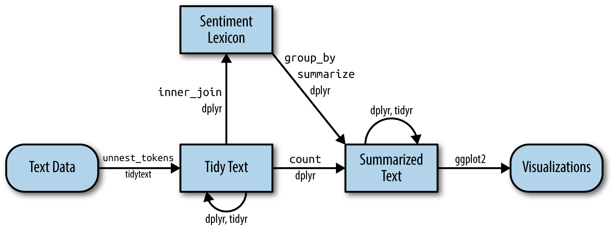

```{r setup, message=FALSE}
# Carga de paquetes necesarios
knitr::opts_chunk$set(warning = FALSE)
knitr::opts_chunk$set(message = FALSE)

library(tidyverse)
library(tidymodels) 
library(textrecipes)
library(wordcloud2)
library(stopwords)
library(discrim)
library(naivebayes)
```

## Análisis de noticias financieras

```{r}
data <- read_csv('C:/Users/pamel/Downloads/feeling_procesado.csv')#cargo base de datos
glimpse(data)
```
{.fragment width="500" lenght="700" fig-align="center"}

## Tokenización y stopwords

```{r}
library(tidytext)

object_descriptions <- data |> 
  unnest_tokens('word', news, drop = FALSE) |> 
  anti_join(stop_words, by = 'word') |> 
  filter(!str_detect(word, "[0-9]"))
```

Palabras más frecuentes (_bag of words_) según sentimiento

```{r}
object_descriptions |> 
  count(feeling, word) |> 
  group_by(feeling) |> 
  slice_max(n = 15, order_by = n) |> 
  mutate(word = reorder_within(word, n, feeling)) |> 
  ggplot(aes(n, word)) +
  geom_col() +
  facet_wrap(~feeling, scales = 'free') +
  scale_y_reordered()
```

Vizualizando

```{r}
words <- object_descriptions %>% count(word, sort=TRUE) |> head(50)

wordcloud2(data=words, color='random-dark')

```

```{r}
object_descriptions |> 
  filter(feeling== "positive") |> 
  count(word, sort=TRUE) |> 
  head(40) |> 
  wordcloud2(color='random-dark')
```

## TF-IDF

```{r}
tfidf <- object_descriptions |> 
  count(news, word) |> 
  bind_tf_idf(word, news, n) |> 
  select(c(word, tf_idf)) |> 
  arrange(desc(tf_idf)) |> 
  head(20)


tfidf

```


## Modelado con SVM

```{r}
set.seed(42)

objects_split <- initial_split(data, strata = feeling, prop = 0.7)
objects_training <- training(objects_split)
objects_testing <- testing(objects_split)
```


```{r}
model_recipe <- recipe(feeling ~ news, data = objects_training) %>%
  step_tokenize(news) %>%
  step_stopwords(news) %>%
  step_tfidf(news) 

#prep(model_recipe) %>% bake(new_data = NULL) %>% glimpse()
```

```{r}
#SVM
set.seed(234)
model_SVM <- svm_linear() %>%
  set_mode("classification") %>%
  set_engine("LiblineaR")
```


```{r}
we_svm <- workflow() |> 
          add_recipe(model_recipe) |> 
          add_model(model_SVM)
we_svm

```

```{r}
library(LiblineaR)
svm_fit <- we_svm %>%
  fit(objects_training)

```

```{r}
# Make predictions on the test data
svm_predictions <- predict(svm_fit, objects_testing) %>%
  bind_cols(objects_testing)


```

```{r}
# Make predictions on the test data
svm_predictions <- predict(svm_fit, objects_testing) %>%
  bind_cols(objects_testing)

svm_predictions
```
```{r}
svm_predictions$feeling <- as.factor(svm_predictions$feeling)

conf_matrix <- svm_predictions %>%
  conf_mat(truth = feeling, estimate = .pred_class)

conf_matrix
```

